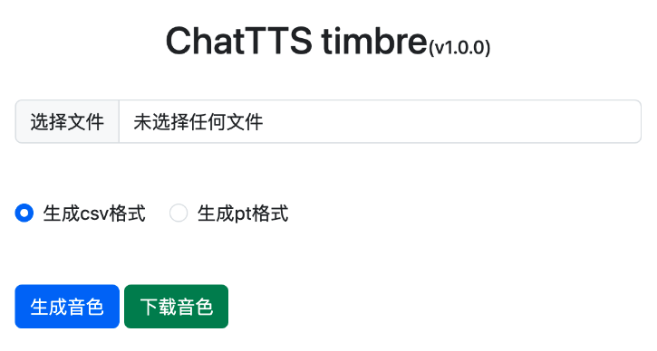

# 介绍

一个简单的本地 html，在网页中根据上传的声音获取音色，界面预览：

# 本地运行

1、创建虚拟环境 `python -m venv venv`

2、激活虚拟环境 `source ./venv/bin/activate`

3、安装依赖管理包 `pip install poetry`

4、安装依赖 `poetry install`

5、启动项目 `python app.py`
